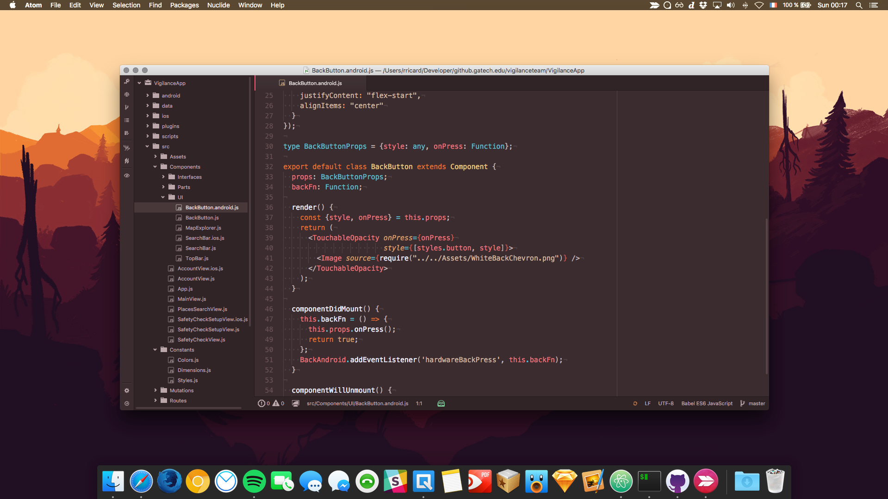

## Firewatch Hot Syntax Theme



A Syntax Theme forked from [SebastianSzturo](https://github.com/SebastianSzturo/firewatch-syntax) that was already inspired by [Firewatch](http://www.firewatchgame.com/). I just changed it to hotter colors. Wallpaper available from the [Campo Santo blog](http://blog.camposanto.com/post/138965082204/firewatch-launch-wallpaper-when-we-redid-the).

## Install

```
apm install firewatch-syntax
```
